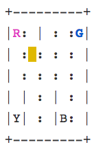

## Smart-Cab-Reinforcement-Learning

This project is a simulation of Self-Driving smart cabs.The Smart Cab’s job is to pick up the passenger at one location and drop them off in another. 

The things that we want our Smart Cab to take care:
<ul>
  <li>Drop off the passenger at the right location.</li>
  <li>Save passenger’s time by taking minimum time possible to drop off.</li>
  <li>Beware of walls </li></ul>

 

We can simulate above environment using <strong>Gym</strong>. The solid rectangle represents the taxi, which is yellow without a passenger and green with a passenger. The pipe ("|") represents a wall which cannot be crossed. R, G, Y, B are the possible pickup and destination locations. The <strong>Blue</strong> letter represents the current passenger pick-up location. The <strong>Purple</strong> letter is the current destination.

The <strong>State Space</strong> is the set of all possible situations our taxi could inhabit. For this environment we have <strong>5*5</strong> grid which means <strong>25</strong> possible locations. These 25 locations are one part of our state space

There are 4 destination locations that we can pick up and drop off a passenger: R, G, Y, B or [(0,0), (0,4), (4,0), (4,3)] in (row, col) coordinates. Our passenger is in location G and they wish to go to location R.

If we have 1 additional passenger state of being inside the taxi, we can take all combinations of passenger locations and destination locations to come to a total number of states for our taxi environment; there are 4 destinations and five (4+1) passenger locations.So, our taxi environment has 5×5×5×4=500 total possible states. (Taxi’s location — 5×5, the passenger’s location — 5, and destination location — 4)

we have six possible actions:
<ul>
  <li> Move South</li>
  <li> Move North</li>
  <li>Move East</li>
  <li>Move West</li>
  <li>Pick-up</li>
  <li>Drop Off</li>
</ul>

We are using <strong>Q-Learning</strong> to train our model.Q-learning lets the agent use the environment’s rewards to learn, over time, the best action to take in a given state.A Q-value for a particular state-action combination is representative of the “quality” of an action taken from that state. Better Q-values imply better chances of getting greater rewards.
